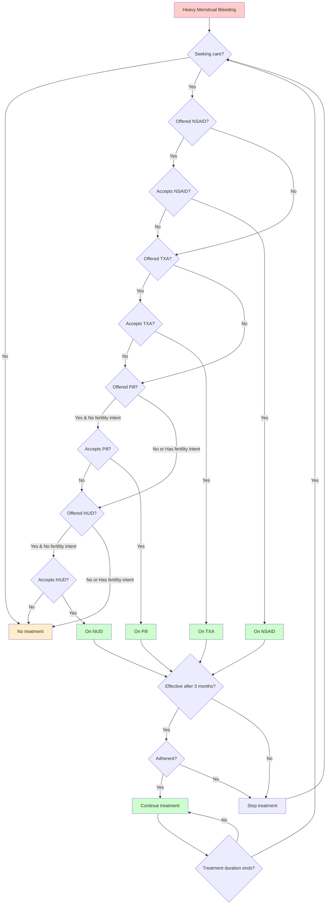

# HMB Contraception Model

A modeling framework for analyzing the impact of hormonal IUD, oral contraceptive pills, and tranexamic acid on heavy menstrual bleeding (HMB), which in turn affects schooling attendance and anemia outcomes.

## Overview

This package extends [Starsim](https://github.com/starsimhub/starsim) and [FPsim](https://github.com/fpsim/fpsim) to model heavy menstrual bleeding and interventions to reduce it. The model tracks:

- Heavy menstrual bleeding states and transitions
- Contraceptive use (hormonal IUD, oral pills)
- Tranexamic acid treatment
- Educational impacts of HMB
- Population-level outcomes

## Modular architecture

The model implements a modular treatment architecture where each treatment (NSAID, TXA, Pill, hIUD) is a standalone intervention that can be used independently or combined in a cascade. The `HMBCascade` orchestrator coordinates sequential treatment offering.

## Care treatment pathway

The care cascade for HMB management follows a sequential progression through treatment options based on care-seeking behavior, treatment effectiveness, and adherence:



**Key features of the pathway:**
- **Care-seeking behavior**: Influenced by anemia status, menstrual pain, and individual propensity
- **Sequential cascade**: NSAID → TXA → Pill → hIUD
- **Fertility intent**: Blocks access to hormonal contraceptives (pill/hIUD) for women planning pregnancy
- **Treatment effectiveness**: Assessed after 3 months based on HMB resolution
- **Adherence**:
  - Stochastic with treatment-specific probabilities (NSAID: 70%, TXA: 60%, Pill: 75%, hIUD: 85%)
  - Use-at-will treatments (NSAIDs/TXA): Probabilistic discontinuation when non-adherent
  - Continuous treatments (Pill/hIUD): Immediate cessation when non-adherent
- **Treatment duration**: Automatic stopping after predefined duration or due to ineffectiveness/non-adherence
- **Re-entry**: Individuals whose treatment stops can re-enter the care pathway if HMB persists
- **Treatment continuation**: Women can continue treatments that worked for them rather than being forced to progress through the cascade

## Installation

### Quick install

Clone the repository and install in development mode:

```bash
git clone https://github.com/[your-org]/HMB_contraception.git
cd HMB_contraception
pip install -e .
```

### Install with all dependencies

```bash
pip install -e .[dev]
```

## Requirements

- Python 3.9-3.13
- starsim
- fpsim
- numpy
- pandas
- sciris
- matplotlib
- seaborn

## Usage

### Basic example

```python
import hmb_contraception as hc
import starsim as ss

# Create a simulation with HMB module
sim = ss.Sim(
    modules=[
        hc.Menstruation(),
        hc.Education(),
    ]
)
sim.run()
sim.plot()
```

### Using the treatment cascade with analyzers

```python
import fpsim as fp
import starsim as ss
from menstruation import Menstruation
from education import Education
from interventions import HMBCascade
from analyzers import track_hmb_anemia, track_cascade

# Create modules
mens = Menstruation()
edu = Education()

# Create cascade intervention and analyzers
cascade = HMBCascade(
    pars=dict(
        year=2020,
        time_to_assess=ss.months(3),
    )
)
anemia_analyzer = track_hmb_anemia()
cascade_analyzer = track_cascade()

# Create and run simulation
sim = fp.Sim(
    start=2020,
    stop=2030,
    n_agents=5000,
    location='kenya',
    education_module=edu,
    connectors=[mens],
    interventions=[cascade],
    analyzers=[anemia_analyzer, cascade_analyzer],
)
sim.run()

# Access analyzer results
print(f"Anemia-HMB relationships: {anemia_analyzer.results}")
print(f"Cascade progression: {cascade_analyzer.results}")
```

### Using individual treatment components

```python
from interventions import NSAIDTreatment, TXATreatment

# Use individual treatments for component analysis
nsaid = NSAIDTreatment(
    pars=dict(
        year=2020,
        efficacy=0.5,
        adherence=0.7,
    )
)

sim = fp.Sim(
    start=2020,
    stop=2030,
    n_agents=5000,
    location='kenya',
    education_module=edu,
    connectors=[mens],
    interventions=[nsaid],
)
sim.run()
```

### Running scenarios

The package includes several analysis scripts:

- `run_baseline.py` - Baseline simulation and characteristics plotting
- `run_cascade.py` - Full cascade intervention analysis with visualization
- `run_component_analysis.py` - Component-level treatment impact analysis
- `run_care_sensitivity.py` - Care-seeking parameter sensitivity analysis
- `analyze_cascade_impact.py` - Treatment success probability calculations

## Project structure

- `menstruation.py` - Core HMB state module
- `interventions.py` - Modular treatment interventions (NSAIDTreatment, TXATreatment, PillTreatment, hIUDTreatment, HMBCascade)
- `education.py` - Educational impact modeling
- `analyzers.py` - Specialized analyzers for tracking HMB-anemia relationships and cascade progression
- `utils.py` - Shared utility functions (logistic regression)
- `component_analysis.py` - Tools for analyzing individual treatment impacts
- `analyze_cascade_impact.py` - Heuristic calculator for treatment success probabilities
- `run_baseline.py` - Baseline simulation runner
- `run_cascade.py` - Full cascade analysis runner
- `run_component_analysis.py` - Component analysis runner
- `run_care_sensitivity.py` - Care-seeking sensitivity analysis
- `tests/` - Comprehensive test suite
- `data/` - Input data files

## Testing

The package includes a comprehensive test suite in `tests/test_hmb_interventions.py` that validates:

- Care-seeking rates respond appropriately to anemia and pain
- Treatment effectiveness matches configured efficacy parameters
- Treatment durations follow expected distributions
- Treatment cascade progresses correctly through the care pathway

Run tests with:
```bash
cd tests
pytest test_hmb_interventions.py -v
```

## Version

Current version: 0.4.0

See [CHANGELOG.md](CHANGELOG.md) for version history.

### What's new in 0.4.0

- **Modular intervention architecture**: Refactored monolithic intervention into standalone treatment classes (NSAIDTreatment, TXATreatment, PillTreatment, hIUDTreatment) with HMBCascade orchestrator
- **Enhanced anemia tracking**: New `track_hmb_anemia()` analyzer monitors HMB-anemia relationships with stratified prevalence
- **Critical bug fixes**:
  - Fixed execution order to ensure interventions affect anemia outcomes (sequelae now calculated after interventions)
  - Women can continue treatments that worked instead of being forced through cascade
- **Treatment-specific adherence**: Use-at-will treatments (NSAIDs/TXA) use probabilistic discontinuation; continuous treatments (Pill/hIUD) use immediate cessation
- **Component analysis tools**: New scripts for analyzing individual treatment impacts and cascade progression
- **Comprehensive analyzers**: Track cascade depth, treatment progression, and care-seeking behavior

## License

[Add license information]

## Citation

[Add citation information when available]

## Contact

[Add contact information]
