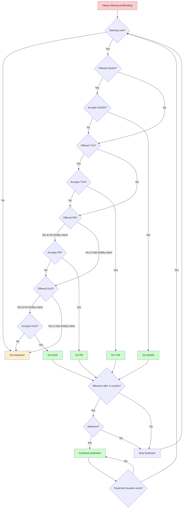

# HMB Contraception Model

A modeling framework for analyzing the impact of hormonal IUD, oral contraceptive pills, and tranexamic acid on heavy menstrual bleeding (HMB), which in turn affects schooling attendance and anemia outcomes.

## Overview

This package extends [Starsim](https://github.com/starsimhub/starsim) and [FPsim](https://github.com/fpsim/fpsim) to model heavy menstrual bleeding and interventions to reduce it. The model tracks:

- Heavy menstrual bleeding states and transitions
- Contraceptive use (hormonal IUD, oral pills)
- Tranexamic acid treatment
- Educational impacts of HMB
- Population-level outcomes

## Care treatment pathway

The model implements a sequential care cascade for HMB management, where individuals progress through treatment options based on care-seeking behavior, treatment effectiveness, and adherence:



**Key features of the pathway:**
- **Care-seeking behavior**: Influenced by anemia status, menstrual pain, and individual propensity
- **Sequential cascade**: NSAID → TXA → Pill → hIUD
- **Fertility intent**: Blocks access to hormonal contraceptives (pill/hIUD) for women planning pregnancy
- **Treatment effectiveness**: Assessed after 3 months based on HMB resolution
- **Adherence**: Stochastic with treatment-specific probabilities (NSAID: 70%, TXA: 60%, Pill: 75%, hIUD: 85%)
- **Treatment duration**: Automatic stopping after predefined duration or due to ineffectiveness/non-adherence
- **Re-entry**: Individuals whose treatment stops can re-enter the care pathway if HMB persists

## Installation

### Quick install

Clone the repository and install in development mode:

```bash
git clone https://github.com/[your-org]/HMB_contraception.git
cd HMB_contraception
pip install -e .
```

### Install with all dependencies

```bash
pip install -e .[dev]
```

## Requirements

- Python 3.9-3.13
- starsim
- fpsim
- numpy
- pandas
- sciris
- matplotlib
- seaborn

## Usage

### Basic example

```python
import hmb_contraception as hc
import starsim as ss

# Create a simulation with HMB module
sim = ss.Sim(
    modules=[
        hc.Menstruation(),
        hc.Education(),
    ]
)
sim.run()
sim.plot()
```

### Using the care pathway intervention with analyzers

```python
import fpsim as fp
from menstruation import Menstruation
from education import Education
from interventions import HMBCarePathway
from analyzers import track_care_seeking, track_tx_eff, track_tx_dur, track_hmb_anemia

# Create modules
mens = Menstruation()
edu = Education()

# Create intervention and analyzers
pathway = HMBCarePathway(
    year=2020,
    time_to_assess=3,  # months before assessing treatment effectiveness
)
care_analyzer = track_care_seeking()
tx_eff_analyzer = track_tx_eff()
tx_dur_analyzer = track_tx_dur()
anemia_analyzer = track_hmb_anemia()  # Track HMB-anemia relationships

# Create and run simulation
sim = fp.Sim(
    start=2020,
    stop=2030,
    n_agents=5000,
    location='kenya',
    education_module=edu,
    connectors=[mens],
    interventions=[pathway],
    analyzers=[care_analyzer, tx_eff_analyzer, tx_dur_analyzer, anemia_analyzer],
)
sim.run()

# Access analyzer results
print(f"Treatment effectiveness: {tx_eff_analyzer.results}")
print(f"Care-seeking rates: {care_analyzer.results}")
print(f"Anemia-HMB relationships: {anemia_analyzer.results}")
```

### Running scenarios

The package includes several example scripts:

- `test_run.py` - Basic test of the model
- `run_kenya.py` - Kenya-specific parameterization
- `run_kenya_package_extended.py` - Extended intervention package analysis
- `run_sensitivity_analysis.py` - Parameter sensitivity analysis

## Project structure

- `menstruation.py` - Core HMB state module
- `interventions.py` - Contraceptive and treatment interventions (HMBCarePathway)
- `education.py` - Educational impact modeling
- `analyzers.py` - Specialized analyzers for tracking care-seeking, treatment effectiveness, and durations
- `utils.py` - Shared utility functions (logistic regression)
- `tests/` - Comprehensive test suite
- `data/` - Input data files
- `figures/` - Output visualizations
- `results_stochastic_extended/` - Saved simulation results

## Testing

The package includes a comprehensive test suite in `tests/test_hmb_interventions.py` that validates:

- Care-seeking rates respond appropriately to anemia and pain
- Treatment effectiveness matches configured efficacy parameters
- Treatment durations follow expected distributions
- Treatment cascade progresses correctly through the care pathway

Run tests with:
```bash
cd tests
pytest test_hmb_interventions.py -v
```

## Version

Current version: 0.4.0

See [CHANGELOG.md](CHANGELOG.md) for version history.

### What's new in 0.4.0

- **Enhanced anemia tracking**: New `track_hmb_anemia()` analyzer monitors relationships between HMB and anemia, including stratified prevalence and counts
- **Age-based HMB risk**: Implemented age-specific odds ratios for HMB susceptibility based on Tanzania study data
- **School disruption modeling**: Added tracking of HMB-driven school disruptions with treatment-specific mitigation effects
- **Analysis tools**: New `plot_analysis.py` module provides comprehensive baseline simulation visualization capabilities

## License

[Add license information]

## Citation

[Add citation information when available]

## Contact

[Add contact information]
